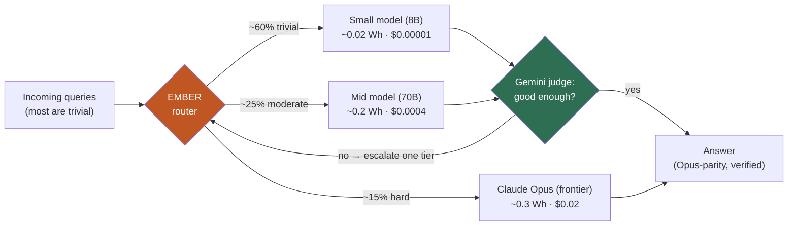
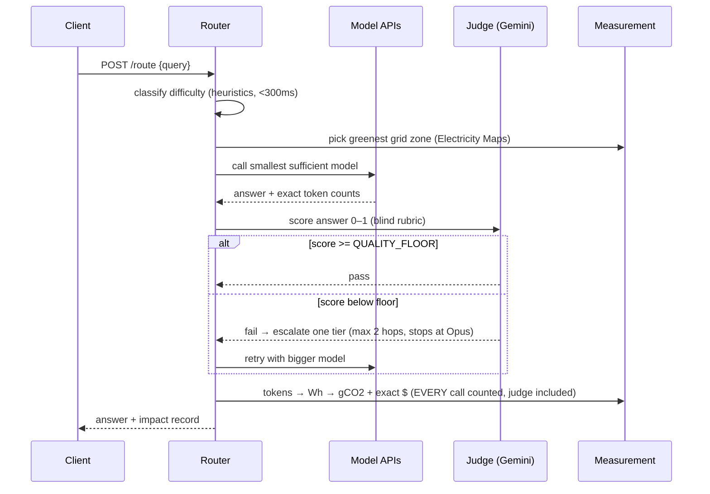
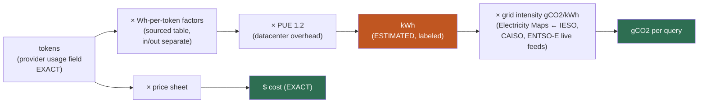
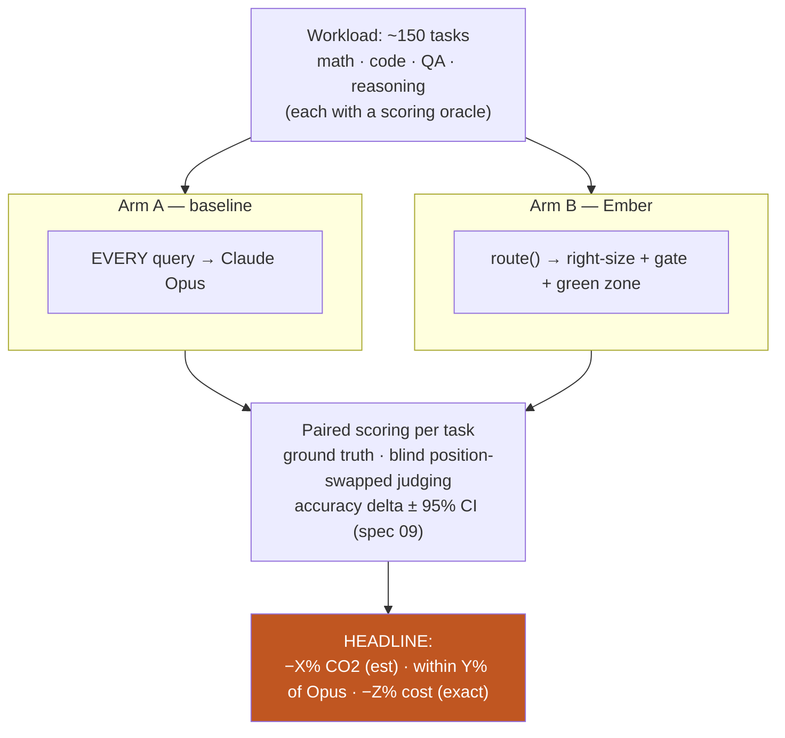
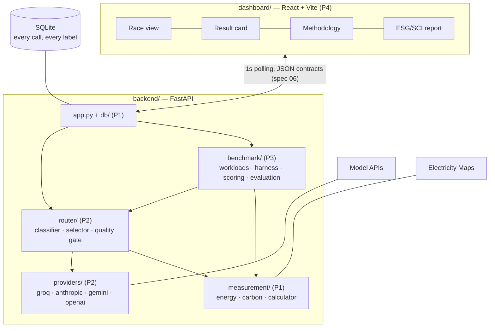
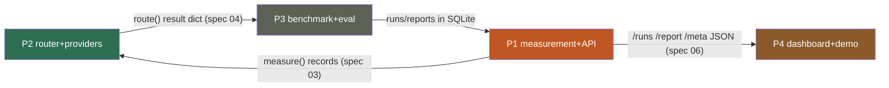

# Ember — Visual Overview & Team Guide

**Read this first.** What Ember does, why, how the pieces connect, and who builds what.
Details live in [`specs/`](./specs/README.md) — this page is the map, not the territory.

---

## 1. The problem and the objective

Every AI product today sends **every** query to a frontier model. Most queries are
trivial — a frontier model answering "reformat this date" is a truck delivering milk.
That waste has two invisible costs: **money** (frontier tokens are 100–1000× the
price) and **carbon** (bigger models burn more energy per token, and the grid
powering the datacenter can be 10× dirtier depending on where/when).

**Main objectives, in priority order:**

1. **Frontier-parity answers** — output quality must be statistically equal to using
   the latest Claude Opus for everything. This is the hard constraint, never traded.
2. **Cut cost** — measured exactly, from real API price sheets.
3. **Cut carbon** — estimated transparently, every assumption published.
4. **Prove it** — an A/B benchmark with paired statistics, not claims.

**The one-line pitch:** *"Same answers as the latest Opus, at a fraction of the cost
and carbon — measured, verified, and audit-ready."*

**The vendor story:** Meta's open models (via Groq) do the cheap work · Anthropic's
Opus is the frontier guarantee · Google's Gemini is the independent referee.

---

## 2. How a single query flows

Key honesty rule (**D4**): the classifier call, the judge call, and every failed
escalation attempt count **against Ember's totals**. The savings number hides nothing.

---

## 3. The impact chain — where the numbers come from

Two provenance grades, always labeled in the UI: **cost is exact**; **energy/carbon
is a transparent estimate** (we can't put a meter inside a provider's datacenter —
nobody can — so we publish every factor and assumption instead; spec 03).

---

## 4. How we prove it — the A/B benchmark

Parity is **pre-registered**: the claim holds only if the confidence interval of the
accuracy delta stays within ±2 percentage points of all-Opus (spec 09). The demo is
two live CO₂+$ counters diverging on one screen, backed by this stored run.

---

## 5. System components

---

## 6. Team delegation — 4 people

Each person **owns specs end-to-end** (code, edge cases, acceptance criteria).
Interfaces between people are the JSON contracts in spec 06 and the mock data in
spec 07 — you can build in parallel without waiting on each other.

| Person | Role | Owns (specs) | Directories | First deliverable |
|---|---|---|---|---|
| **P1** | Backend core & data | 03 measurement · 06 API/DB | `backend/measurement` `backend/db` `backend/app.py` `data/` | `/runs/{id}` polling endpoint serving real rows (h8) |
| **P2** | Router & providers | 02 providers · 04 router | `backend/providers` `backend/router` | `route()` end-to-end with judge + escalation (h8) |
| **P3** | Benchmark & evaluation | 05 benchmark · 09 evaluation | `backend/benchmark` `data/workloads` | 150-task workload + resumable harness dry run (h14) |
| **P4** | Dashboard & demo | 07 dashboard · 08 demo script | `dashboard/` | Race view animating on mock JSON (h8) |

**Everyone reads:** this page + spec 00 + spec 01. **Then only your own specs.**

**Sync points (whole team, 10 minutes each):**
- **h8** — contracts frozen: P1's endpoint shapes and P2's `route()` dict locked; P4 confirms mocks match.
- **h14** — first integration: dashboard on real endpoints; dry-run 20 tasks; tune `QUALITY_FLOOR` together.
- **h20** — full benchmark run (~1 h); everyone reviews the numbers before freeze.
- **h32** — rehearsal ×2 with Wi-Fi off.

**Cross-cutting rules for everyone:** every number carries a provenance label ·
never guess silently (missing usage/unknown model = loud error) · spec and code
change in the same commit · nothing merges to `main` that breaks `backend.smoke`.

---

## 7. Current status

- ✅ Specs 00–09 complete · repo structured · providers + measurement built and smoke-tested
- 🔑 **Blocked on keys (O1):** `GEMINI_API_KEY` (sponsor) · `GROQ_API_KEY` (free) ·
  `ELECTRICITYMAPS_TOKEN` (free) · `ANTHROPIC_API_KEY` (credits)
- 🔨 Next: router (spec 04), then benchmark (spec 05)
